# Customizing Subsite Styles

## Defining Colors

Create color variables in `app/assets/stylesheets/vars.scss`:

```
/* NEW_SUBDOMAIN */
$new_subdomain-blue: #2C3590;
$new_subdomain-orange: #A66401;
$new_subdomain-gray: #716C6B;
```

These colors can be named anything you like, you'll use them as variables in SASS mixins.

## Customizable components

Create a new file for the subsite styles (`assets/stylesheets/subdomains/_new_subdomain.scss`).

This file should define a single class which matches your new subdomain name, which includes 6 application component SASS mixins (see specifics below):

```
  .new_subdomain {
    @include color_scheme($primary_color, $action_color, $footer_color, $underline_color, $cms_link_color);
    @include banner( $background_color, $custom_banner_font, $slogan_alignment, $text_color);
    @include buttons($button_color, $text_color);
    @include course_widget($primary_bg_color, $secondary_bg_color);
    @include lesson_tile($bg_color, $completed_bg_color, $check_color);
    @include icons($icon_color, $check_color);
  }
```

### `color_scheme`

The main color scheme options for headings, links and colored text.

- `$primary_color`

  - Text for headings & form input labels
  - Required

    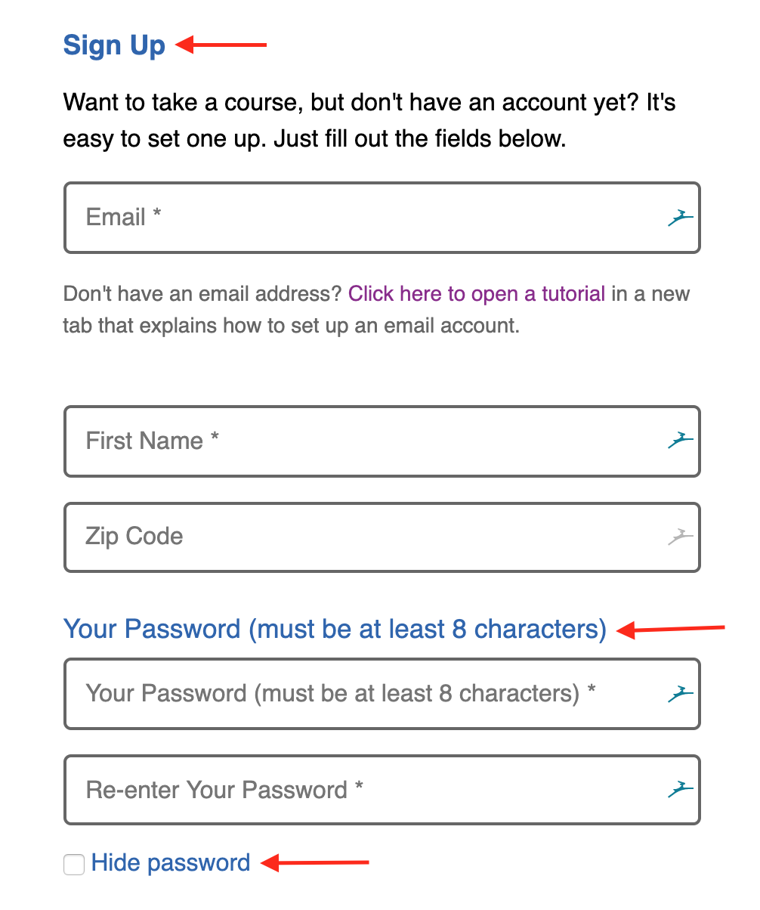

- `$action_color`

  - Color for all links
  - Required

    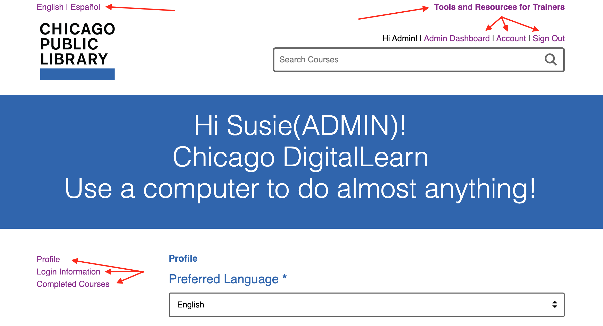

- `$footer_color`

  - Background color for footer
  - Default: `$primary_color`

    

- `$underline_color`

  - Underline for some table rows. Ex/ course completion rows
  - Deafult: `$primary_color`

    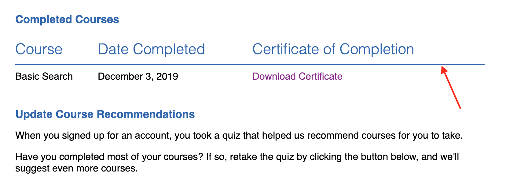

- `$cms_link_color`

  - Color of cms page links in footer
  - Deafult: `$white`

    

### `banner`

Banner background & text colors and font sizes (if specified)

- `$background_color`

  - Background of the main header banner
  - Required

    

- `$custom_banner_font`

  - Banner text font size
  - Default: `3.3em`

    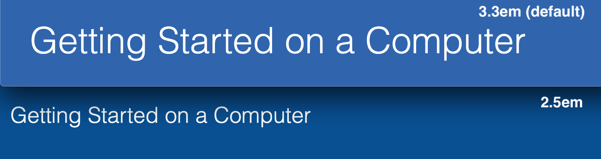

- `$slogan_alignment`

  - Text alignment of header slogan (unauthenticated landing page)
  - Default: `left`

    

- `$text_color`

  - Text color in main banner
  - Default: `$white`

    

### `buttons`

Defines background and text color for buttons

- `$button_color`

  - Background color for buttons
  - Required

    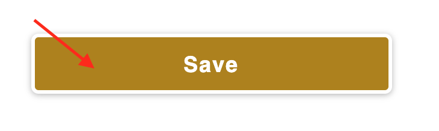

- `$text_color`

  - Text color for buttons
  - Default: `$white`

    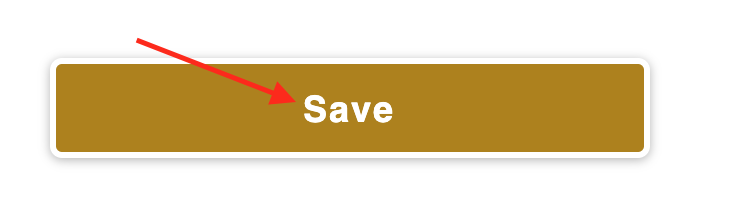

### `course_widget`

Course widget header background. Two colors are provided, and the result is a gradient between them.

- `$primary_bg_color`

  - Primary course widget header background color
  - Required

    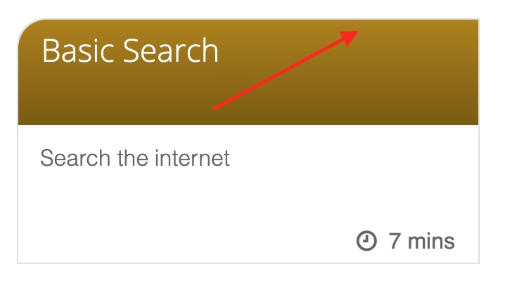

- `$secondary_bg_color`

  - Secondary course widget header background color
  - Default: `$primary_background`

    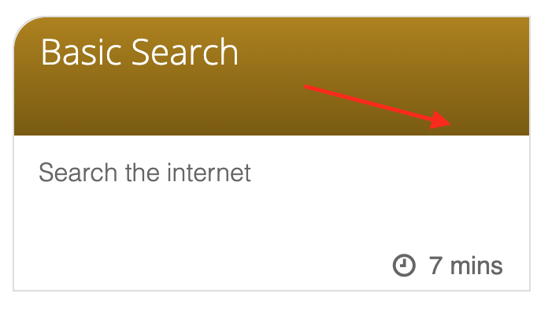

### `lesson_tile`

Lesson widget boxes

- `$bg_color`

  - Header background color for incomplete lesson tiles
  - Required

    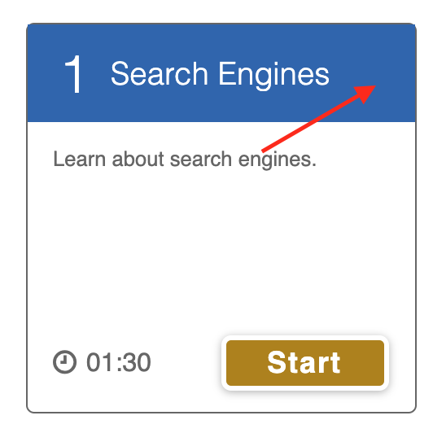

- `$completed_bg_color`

  - Header background color for completed lesson tiles
  - Required

    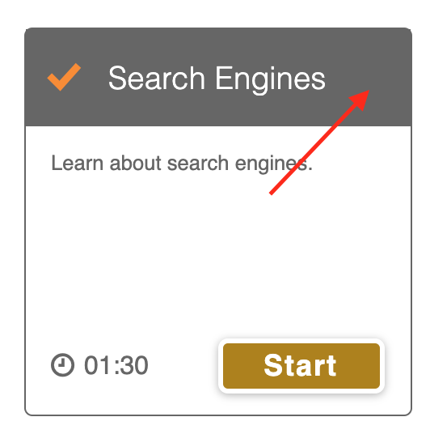

- `$check_color`

  - Color of checkmark on completed lesson tiles
  - Required

    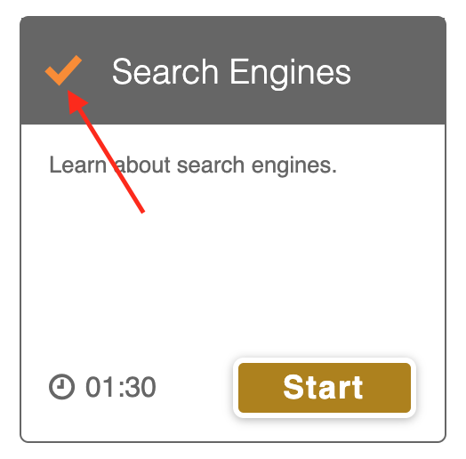

### `icons`

All site icons not previously accounted for.

- `$icon_color`

  - Primary icon color for icons without a previously specified color
  - Required

    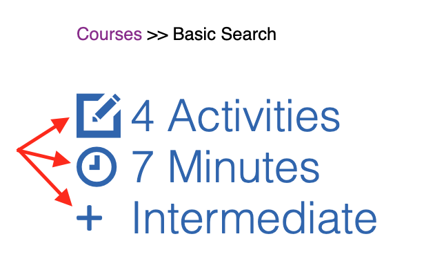

- `$check_color`

  - Color for checkmark next to completed lessons in "lesson playlist"
  - Required

    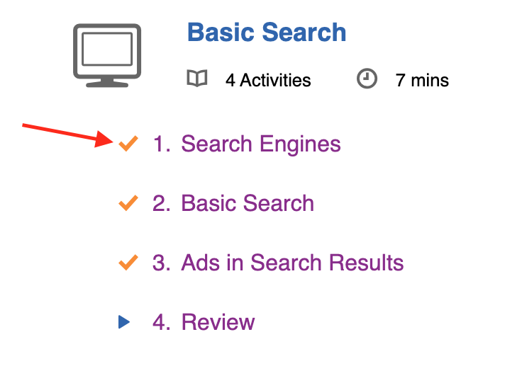
